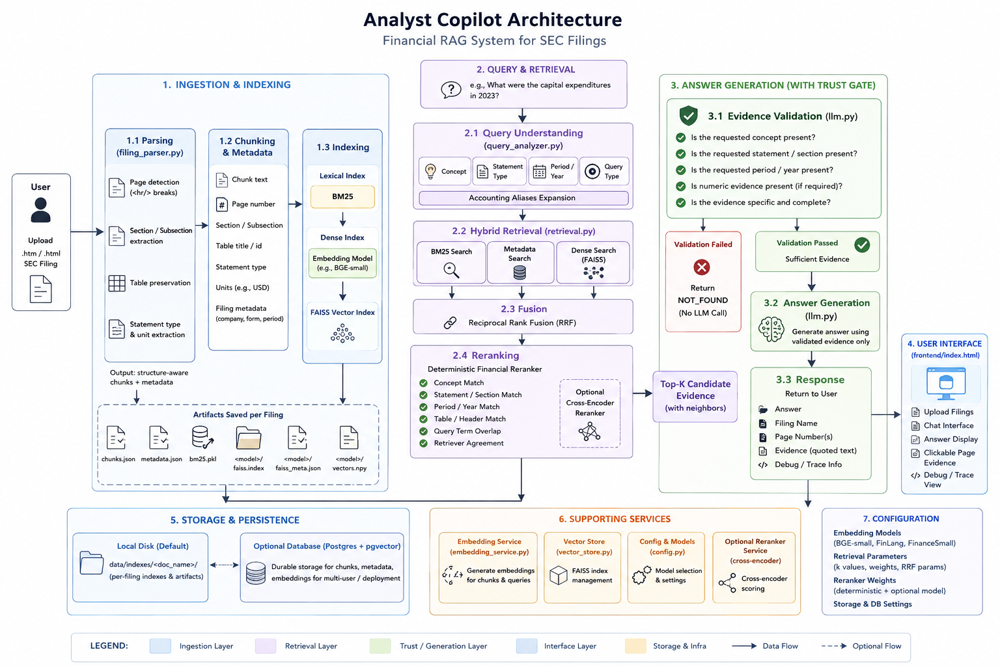
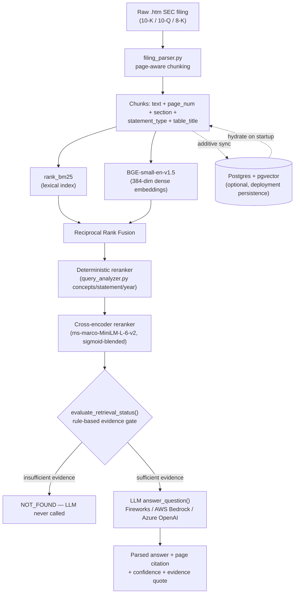

# Analyst Copilot — Technical Documentation

This is the full technical writeup behind the one-page approach note in the
README: architecture, the retrieval math and notation, the formulas the
system uses for financial calculations, the scoring criteria it's built
against, measured results, and what makes this implementation different
from a naive RAG-over-PDFs system. Referenced from the README; read this
for the "how" and "why," the README for "how to run it."

---

## 1. Architecture



The flowchart below is the same architecture in a portable, always-renders
form (GitHub/most Markdown viewers render Mermaid natively); the image
above is the same system laid out with more module-level detail.



**Why the gate sits before the LLM, not after**: the scoring rubric
(§4 below) punishes a wrong answer twice as hard as it rewards a right one,
while abstaining is always free. Every retrieval-quality problem has to be
caught *before* generation, because a wrong answer generated from weak
evidence costs more than never answering at all. `evaluate_retrieval_status()`
in `backend/llm.py` runs four rule-based checks — concept match, statement/
section match, fiscal-year match, numeric-value presence — against the top
retrieved chunks, and returns `NOT_FOUND` immediately if any applicable
check fails. The LLM is never invoked on weak evidence; there's no
confidence score to second-guess after the fact.

### Module map

| File | Responsibility |
|---|---|
| `backend/filing_parser.py` | `.htm` → page-aware chunks (page numbers tracked from printed labels near `<hr/>` breaks, not estimated) |
| `backend/query_analyzer.py` | Extracts concept/statement/year/ratio-formula intent from the question text |
| `backend/retrieval.py` | BM25 + FAISS hybrid search, RRF fusion, deterministic + cross-encoder reranking |
| `backend/numerical_reasoner.py` | Builds structured evidence notes (concept coverage, required formulas) for calculation questions |
| `backend/llm.py` | Evidence gate, prompt construction, multi-provider LLM dispatch, answer parsing |
| `backend/postgres_store.py` | Optional Postgres + pgvector persistence, additive to local files |
| `backend/main.py` | FastAPI app — upload/index (SSE progress), chat endpoints, page-viewer endpoint |
| `scripts/evaluate.py` | Scoring harness against `practice-questions.jsonl`, implements the exact rubric below |

---

## 2. Notation and formulas

### 2.1 Retrieval fusion (Reciprocal Rank Fusion)

Two independent retrievers score every chunk in a filing:

- **BM25** (`rank_bm25`), a lexical/keyword scorer — strong on exact terms
  ("capital expenditure", "$1,577") that dense embeddings blur.
- **Dense retrieval** (BGE-small-en-v1.5, 384-dim), a semantic scorer —
  strong on paraphrased questions where the filing's exact wording differs
  from the question's.

Neither is used alone. Their ranked lists are fused with **weighted
Reciprocal Rank Fusion**:

```
RRF(chunk) = Σ  weight_r / (k + rank_r(chunk) + 1)
             r ∈ retrievers
```

where `rank_r(chunk)` is chunk's 0-indexed rank in retriever `r`'s ranked
list (chunks it didn't return contribute 0), `k = 60` (`RRF_K` in
`config.py`), and weights are `1.0` for BM25, `1.0` for dense, `0.9` for a
metadata-match signal. Implementation (`backend/retrieval.py`):

```python
def _rrf_fuse(weighted_ranked_lists, k=60):
    scores = {}
    for ranked, weight in weighted_ranked_lists:
        for rank, idx in enumerate(ranked):
            scores[idx] = scores.get(idx, 0.0) + weight / (k + rank + 1)
    return scores
```

RRF is rank-based, not score-based — it only needs each retriever to
produce a *reasonable ordering*, not comparable scores. That's what lets
Postgres full-text search (`ts_rank_cd`) substitute for local BM25 in the
deployed/Postgres-backed path without changing the fusion math at all.

Retrieval depth: `BM25_TOP_K = SEMANTIC_TOP_K = 50` candidates per
retriever, fused down to `RRF_TOP_K = 80`, reranked down to
`RERANK_TOP_K = 12` chunks handed to the LLM.

### 2.2 Deterministic rerank score

After fusion, every candidate chunk gets a **content evidence score**
(`backend/retrieval.py::deterministic_rerank`):

```
score(chunk) = retrieval_score × 100
             + 60.0   if chunk matches the query's normalized financial concept
             − 40.0   if a concept was requested but this chunk doesn't match it
             + 20.0   if chunk's period matches the requested fiscal year
             + 20.0   if chunk contains a numeric value
             + 20.0   if both BM25 and dense retrieval agree on this chunk
             + 25.0   if chunk's statement type matches the requested statement
             + 15.0   if chunk is a table and the query needs a lookup/calculation
             + (structural boosts: query-term overlap, table-header match,
                comparison-dimension match, filing-purpose match)
```

This is the layer that makes retrieval "financially aware" rather than
purely lexical/semantic — e.g. it's what lets a query for "quick ratio"
know to boost chunks containing `CASH_AND_EQUIVALENTS`/`ACCOUNTS_RECEIVABLE`/
`CURRENT_LIABILITIES` even though the filing never uses the words "quick
ratio" anywhere.

### 2.3 Cross-encoder blend

An optional local cross-encoder (`ms-marco-MiniLM-L-6-v2`) re-scores the
top candidates for semantic relevance to the literal question text. Its
raw logit is **sigmoid-normalized and blended additively** with the
deterministic score above, not used as a full override:

```
final_score(chunk) = deterministic_score(chunk) + sigmoid(cross_encoder_logit) × 30.0
```

This was a deliberate fix, not the original design — see §6.

### 2.4 Evidence sufficiency gate

`evaluate_retrieval_status()` (`backend/llm.py`) runs before any LLM call.
Evidence is `SUFFICIENT` only if every *applicable* rule passes:

1. **Concept rule** — top chunks contain the requested concept or an
   accounting alias.
2. **Statement/section rule** — top chunks match the explicitly requested
   statement type (balance sheet, income statement, ...), when one was
   requested.
3. **Period rule** — top chunks contain the requested fiscal year.
4. **Numeric-value rule** — top chunks contain digits, for lookup/
   calculation questions.

Any applicable rule failing → `WEAK_EVIDENCE` → the answer is `NOT_FOUND`,
scored `0`, and no LLM call is made.

### 2.5 Named-ratio formulas (`DERIVED_RATIOS`, `query_analyzer.py`)

Analyst questions frequently name a ratio ("quick ratio," "capital-
intensive") without spelling out its formula — the underlying line items
never literally appear together as "quick ratio" in a filing. This table
maps the name to the concepts retrieval must fetch and the formula the LLM
is instructed to apply. Every formula convention below was **reverse-
engineered against this dataset's own gold answers**, not assumed from a
textbook:

| Ratio | Formula | Note |
|---|---|---|
| Quick Ratio | `(Cash + ST Investments + Net Receivables) / Current Liabilities`, falling back to `(Current Assets − Inventory) / Current Liabilities` | This dataset's gold answer used the granular line-item sum (1.57) over the textbook approximation (1.77) for the same filing — confirmed, not assumed. |
| Current Ratio | `Current Assets / Current Liabilities` | "Working capital ratio" is an alias for the same formula. |
| Inventory Turnover | `COGS / Ending Inventory` (not average inventory) | Confirmed against AES FY2022: `$10,069M / $1,055M = 9.55` matches gold (9.5) exactly; the average-inventory variant gives 12.1, confirmed wrong. |
| Capital Intensity | Judged from `CAPEX / Revenue`, `PP&E(net) / Total Assets`, `ROA = Net Income / Total Assets` — not raw dollar magnitudes | A verdict question, not a single-number lookup. |
| Debt-to-Equity | `Total Debt / Total Equity` | |

### 2.6 Scoring criteria (the rubric this whole system is optimized for)

From the brief (`analyst.pdf`), implemented exactly in `scripts/evaluate.py`:

| System output | Points |
|---|---|
| Correct answer, correct page (exact match, no tolerance) | **+1** |
| "Not found in this filing" (honest abstain) | **0** |
| Correct answer, wrong/missing page | **0** |
| Confidently wrong answer | **−1** |

A system that always abstains scores exactly 0. A system that guesses
finishes below 0. **Every design decision in this codebase — the gate
before generation, the strict "quote the source or say NOT_FOUND" prompt,
zero page-tolerance in the evaluator — exists because this rubric punishes
a wrong answer twice as hard as it rewards a right one.**

---

## 3. Code walkthrough (key snippets)

**Page-aware chunking** — the printed page-number label before a `<hr/>`
break belongs to the page that *starts* after the break, not the one that
just ended:

```python
# backend/filing_parser.py
if pnum is not None and (resync or -1 <= (pnum - current_page) <= 20):
    current_page = pnum          # trust a real, plausible label
else:
    current_page = current_page + 1   # no label -- advance one physical page
```

**Multi-provider LLM dispatch** — one call site, provider chosen by
`LLM_PROVIDER`:

```python
# backend/llm.py
async def _call_llm(messages, max_retries=4):
    if LLM_PROVIDER == "bedrock":
        return await _call_bedrock(messages, max_retries=max_retries)
    if LLM_PROVIDER == "bedrock_openai":
        return await _call_bedrock_openai(messages, max_retries=max_retries)
    if LLM_PROVIDER == "azure":
        return await _call_azure(messages, max_retries=max_retries)
    return await _call_fireworks(messages, max_retries=max_retries)
```

**NOT_FOUND abstain check** — first-line match, not full-string, so a
model that adds analysis after a correct `NOT_FOUND` still abstains safely:

```python
# backend/llm.py
answer_head = answer.split("\n", 1)[0].strip().rstrip(".:").upper()
if answer and answer_head != "NOT_FOUND":
    # treat as a real answer
```

**Postgres-additive persistence** — every ingest also syncs to Postgres
when configured, and startup hydrates any filing Postgres knows about that
local disk doesn't:

```python
# backend/ingest.py
async def _sync_to_postgres_if_configured(index):
    if not pg.is_configured():
        return
    await pg.save_filing(index.doc_name, index.chunks, index.vectors,
                          get_embedding_model_name(), metadata=index.metadata)
```

---

## 4. What makes this different (outstanding features)

A naive RAG-over-filings system chunks text, embeds it, and answers from
whatever comes back. This system is built specifically for the -1/-0/+1
asymmetry in the brief, and that shapes every layer:

- **Abstain-first by construction, not by prompt alone.** The rule-based
  `evaluate_retrieval_status()` gate runs before generation and can
  return `NOT_FOUND` without ever invoking the LLM. Most RAG systems rely
  on the LLM's own judgment to decline — here, the LLM is architecturally
  prevented from answering on evidence that fails a checklist.
- **Financially-aware retrieval, not generic semantic search.** The
  deterministic reranker understands accounting concepts, statement types,
  and fiscal years as first-class signals (§2.2) — a lay-phrased MD&A
  sentence can't outrank the actual balance sheet line it's describing,
  because concept/statement matching is scored explicitly, not left to
  embedding similarity alone.
- **Named-ratio expansion.** Ratios and verdict frameworks ("quick ratio,"
  "capital-intensive") never appear verbatim in a filing. `DERIVED_RATIOS`
  expands the name into the concepts retrieval must fetch and the exact
  formula convention this dataset's own answer key uses — reverse-
  engineered against real gold answers (§2.5), not textbook-assumed.
- **Page-exact citation, verified against real filings.** Page attribution
  is tracked from the filing's own printed page-number labels, with a
  resync mechanism that self-corrects drift instead of compounding it
  (§6). Verified byte-for-byte against raw SEC HTML, not just unit-tested.
- **Deployment that survives without persistent storage.** Postgres +
  pgvector integration is additive — local files stay authoritative for
  local dev, but a freshly deployed container with an empty, ephemeral
  disk hydrates every previously-indexed filing from Postgres
  automatically on startup (`backend/main.py`'s startup handler), so
  redeploys don't require a seeded volume.
- **A documented, evidenced bug history, not a black box.** Every subtle
  retrieval/parsing bug found in this codebase (§6) was confirmed against
  a real filing and a real gold answer before being called a bug — not
  guessed and patched speculatively.

---

## 5. Measurement — evaluation methodology and example output

### 5.1 How scoring works

`scripts/evaluate.py` runs every question in `practice-questions.jsonl`
through the live pipeline (retrieval → gate → LLM), then grades the
result against the gold answer and gold page using an LLM-as-judge for
answer correctness (handles paraphrased-but-equivalent answers) plus an
exact page match (§2.6 — zero tolerance, this evaluator does not forgive
an off-by-one page).

### 5.2 Example output (real, from this session)

A correct answer (`+1`):

```
Q:  What is Nike's total current liabilities as of FY2018?
A:  $6,040 million
Page: 45
Confidence: 0.98
Source: "Total current liabilities | 6,040 | 5,474" (NIKE, Inc.
         Consolidated Balance Sheets, FY2018, page 45)
```

A correct abstain (`0`), out-of-scope question, evidence gate never let
the LLM guess:

```
Q:  What is the CEO of Nike's favorite color?
A:  NOT_FOUND
Confidence: 0.0
```


---

## 6. Bugs found and fixed (the approach note's evidence trail)

See the README's Approach Note for the short version. In full, each entry
below was confirmed against a real filing and a real gold answer before
being treated as a bug:

1. **Page-citation drift** (`filing_parser.py`) — an early cover/TOC page
   with no digit label caused the running page counter to drift ahead by
   one, after which every subsequent *correct* sequential label failed a
   too-strict "labels only move forward" check and got rejected in turn —
   a permanent, one-way drift for the rest of the document. Fixed with a
   resync check: two consecutive raw labels exactly one page apart are
   trusted even if they disagree with the (possibly already-drifted)
   running counter. Verified against Nike 2018 10-K raw HTML: the balance
   sheet table now lands on page 45 (gold), not the drifted 48.
2. **NOT_FOUND parser safety bug** (`llm.py`) — the parser required an
   exact string match against `"NOT_FOUND"`. A model that wrote
   `ANSWER: NOT_FOUND` correctly, then added an analysis paragraph after
   it (format drift, not a wrong guess), had the whole blob graded as a
   real (wrong) answer — silently turning a safe `0` into a penalized
   `-1`. This is the one failure mode the abstain-first design exists to
   prevent, happening invisibly at the parsing layer.
3. **Cross-encoder score override** (`retrieval.py`) — the reranker's raw
   logit replaced, rather than blended with, the deterministic
   concept/statement score, letting a lay-phrased mention outrank the
   actual financial statement. Fixed with a sigmoid blend (§2.3).
4. **Duplicate-disclosure retrieval trap** — segment revenue/income is
   reported twice in a 10-Q (a concise MD&A summary table, and again,
   more granularly, in a numbered financial-statement Note); nothing
   distinguished them, so "which segment had the lowest X" questions kept
   retrieving the Notes copy. Confirmed against two real misses on the
   same filer (JPMorgan 2021Q1 and 2022Q2 10-Qs).
5. **Non-calendar fiscal-year column confusion** — several filers (Best
   Buy, Nike, Target) name a fiscal year for the calendar year most of it
   falls in; a three-column 10-Q balance sheet's prior-year-same-quarter
   column is easy to mistake for the fiscal-year-end column beside it.
   Confirmed against a Best Buy cash-trend question that got the
   direction backwards.
6. **"(Gain)/(Loss) on X" sign convention** — in an "Other
   (income)/deductions, net" rollup, the caption word sets the true sign,
   not the parenthetical formatting of the adjacent number (these
   sections total net *expense*, so a real gain is entered as a
   subtraction). Confirmed against a Pfizer question where an $8.1B gain
   was read as an $8.1B loss.
7. **Dead synonym-expansion code path** (`retrieval.py`) — a local
   `expand_query()` (financial-term synonym aliases) was silently
   shadowed by an identically-named import a few lines later, meaning
   the synonym expansion had never actually run. Found by introspecting
   which function object the name was bound to at runtime.
